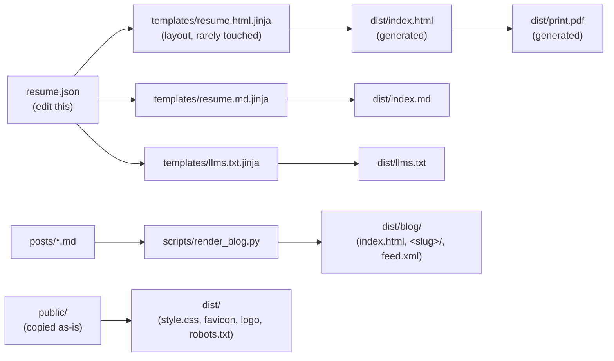

# resume-blog template

Disclaimer: This is vibe-coded and works. I reviewed (at a glance) all the lines of code 
generated. You can read about it [here](https://madhu.dev/blog/hello-world/).

This is not meant to be particularly interesting, but I'm sharing what I've made.

A static resume + blog site, generated end to end from a `resume.json` data
file and a folder of Markdown posts. No Node, no database, no server — just a
small Python pipeline that dumps static files into `dist/`.



`dist/` is the full deployable static site — everything needed to serve it
lives there after a build. It's gitignored and regenerated by `just build`.

`dist/llms.txt` and `dist/index.md` follow the [llms.txt](https://llmstxt.org)
convention: a small, agent-friendly summary at `/llms.txt` linking to a full
Markdown rendition of the resume at `/index.md`, so LLM agents/tools can read
the site without scraping HTML.

## Quick start

1. **Set up tooling**: [`just`](https://github.com/casey/just) and
   [`uv`](https://docs.astral.sh/uv/). For the PDF you need Pango:
   `brew install pango` on macOS, or on Debian/Ubuntu:

   ```sh
   sudo apt-get install -y --no-install-recommends \
     libpango-1.0-0 libharfbuzz0b libpangoft2-1.0-0 libharfbuzz-subset0 \
     libwebp-dev libwebpdemux2 libwebpmux3
   ```

   (that's the same set of packages CI installs in `.github/workflows/`).
2. **Edit `resume.json`** — name, contact, skills, experience, education.
3. **Replace `public/logo.png`/`logo.webp`/`favicon.png`/`favicon.ico`** with
   your own (the repo ships with a generated placeholder).
4. **Write posts** in `posts/` (see [Blog](#blog)).
5. **Build**: `just build`, then preview with `just serve`.
6. **Set your URL** (used for the RSS feed and `llms.txt` links):

   ```sh
   SITE_URL=https://yourdomain.com just build
   ```

> [!IMPORTANT]
> If you never set `SITE_URL`, the build still succeeds — only quieter things
> break: the RSS feed and `llms.txt` will point at the default
> `https://example.com` instead of your real domain. Set it once at build time
> (or export it in your CI) and don't ship the default.

## Files

- `resume.json` — your resume content. Edit this.
- `templates/resume.html.jinja` — the HTML layout/structure. Edit this to
  change how the resume looks or is organized, not its content.
- `templates/resume.md.jinja` — Markdown rendition of the resume (the
  detailed page linked from `llms.txt`).
- `templates/llms.txt.jinja` — the `llms.txt` summary template.
- `public/` — static assets served as-is: `style.css` (including print rules
  via `@page`/`@media print`), `favicon.png`/`favicon.ico`, `logo.png`,
  `robots.txt` (allows all crawlers/agents).
- `posts/` — blog posts as Markdown files with YAML front matter (see
  [Blog](#blog) below). Each becomes `dist/blog/<slug>/`.
- `templates/_nav.html.jinja` — shared Resume / Writing top nav, included on
  every page.
- `templates/blog_index.html.jinja` — blog post listing at `/blog/`.
- `templates/post.html.jinja` — single post layout.
- `templates/feed.xml.jinja` — RSS 2.0 feed at `/blog/feed.xml`.
- `dist/` — generated output (`index.html`, `index.md`, `llms.txt`,
  `print.pdf`, `blog/`, plus a copy of `public/`). Gitignored. Don't edit by hand.
- `scripts/render_html.py` — renders `resume.json` through the template to
  produce `dist/index.html`.
- `scripts/render_llms.py` — renders `resume.json` through the Markdown and
  llms.txt templates to produce `dist/index.md` and `dist/llms.txt`.
- `scripts/build_pdf.py` — renders `dist/index.html` to `dist/print.pdf` via
  WeasyPrint.
- `scripts/render_blog.py` — renders `posts/*.md` to `dist/blog/`: the post
  listing, per-post pages, and the RSS feed.
- `scripts/blog_images.py` — rewrites blog `` tags to responsive WebP
  `srcset`/`sizes` variants at build time (see [Images](#images) below).
- `pyproject.toml` — pins `jinja2`/`weasyprint`/`markdown`/
  `python-frontmatter` for the scripts. Run `uv sync` once to create the
  environment before building.

## Usage

```sh
just build    # resume.json + posts/ + public/ -> dist/ (index.html, blog/, print.pdf, llms.txt/index.md)
just assets   # copy public/ -> dist/ only
just render   # resume.json -> dist/index.html only (fast, no WeasyPrint)
just blog     # posts/*.md -> dist/blog/ only (list, posts, feed)
just pdf      # dist/index.html -> dist/print.pdf only (uses current dist/index.html as-is)
just llms     # resume.json -> dist/index.md + dist/llms.txt only
just serve    # render + blog + llms, then preview dist/ at http://localhost:8000
just clean    # remove dist/
```

## Blog

Posts live in `posts/` as Markdown files with YAML front matter, one file per
post. Name files `YYYY-MM-DD-slug.md` (the date prefix keeps the directory
sorted and is stripped from the URL), or omit the date and set `date` in the
front matter.

```markdown
---
title: "Hello, World"
date: 2026-09-03
summary: "A short description shown on the blog index."
draft: false   # optional; true skips the post in the build
---

Post body in **Markdown**.
```

Each post renders to `dist/blog/<slug>/index.html` (clean URL `/blog/<slug>/`)
with the same inlined CSS and nav as the rest of the site. The listing at
`/blog/` shows title, date, and summary; the RSS feed is generated at
`/blog/feed.xml`.

### Images

Drop blog images in the shared `posts/images/` folder, then reference them by
filename with standard Markdown:

```markdown

```

At build time `scripts/blog_images.py` converts each referenced image to WebP
at a fixed set of widths (`600`, `1200`), writes the variants to
`dist/blog/images/`, and rewrites the post's `` tag to include a
responsive `srcset`/`sizes` so browsers load the smallest appropriate size.
External (`http(s)`/`data:`) URLs pass through untouched. A Markdown image
`title` is emitted as the `title` attribute.

## Deployment

> [!IMPORTANT]
> Add the two secrets below to your GitHub repository before the first push
> to `main`. The deploy job fails fairly opaquely (a wrangler auth error) if
> either is missing, so set them first.

`.github/workflows/deploy.yml` builds `dist/` and publishes it to
[Cloudflare Pages](https://pages.cloudflare.com/) on every push to `main`, via
`wrangler pages deploy`. Change the `--project-name=resume` flag to your
Cloudflare Pages project name.

Requires two GitHub repo secrets (Settings → Secrets and variables →
Actions):

- `CLOUDFLARE_API_TOKEN` — scoped to "Cloudflare Pages: Edit"
- `CLOUDFLARE_ACCOUNT_ID`

Since deployment is a plain static-file upload (no build step on Cloudflare's
side), it's unaffected by their Pages build-minute limits and costs nothing on
the free tier.
